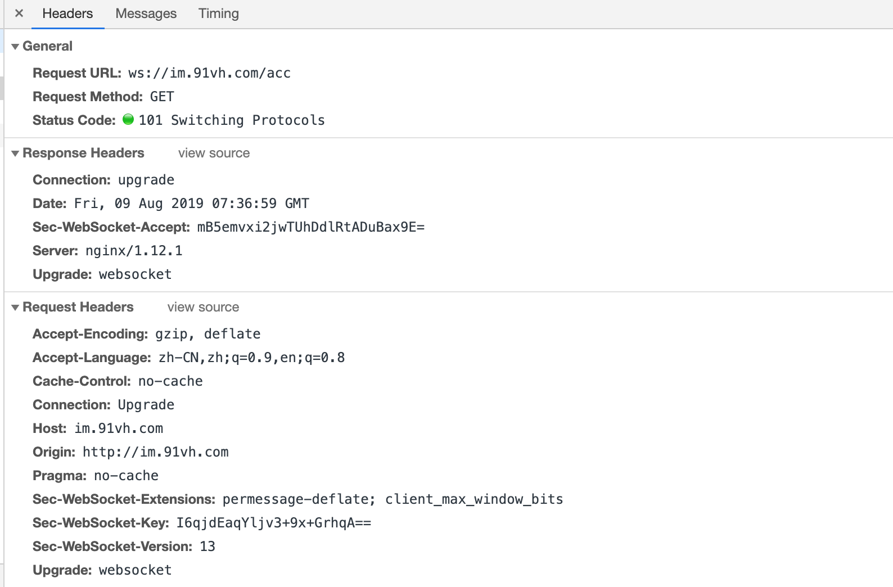
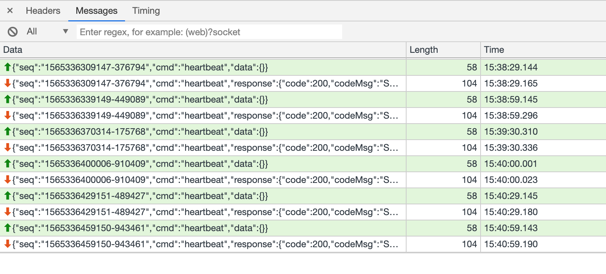
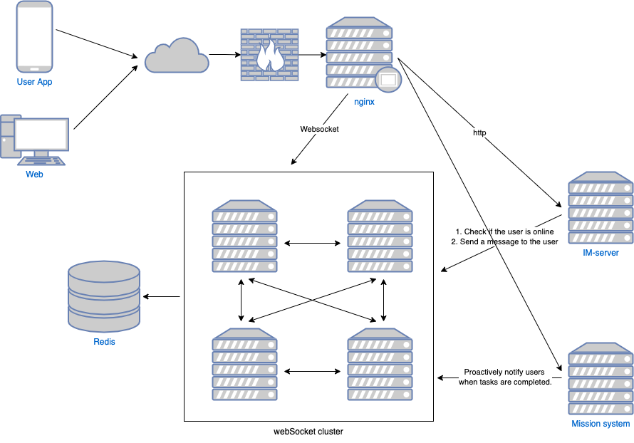
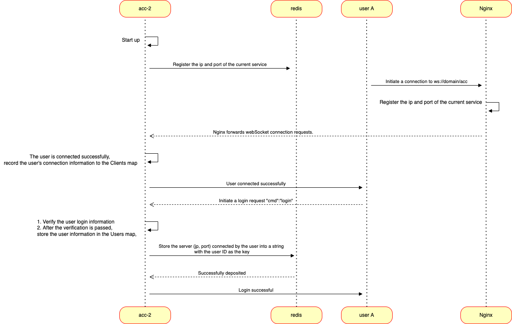
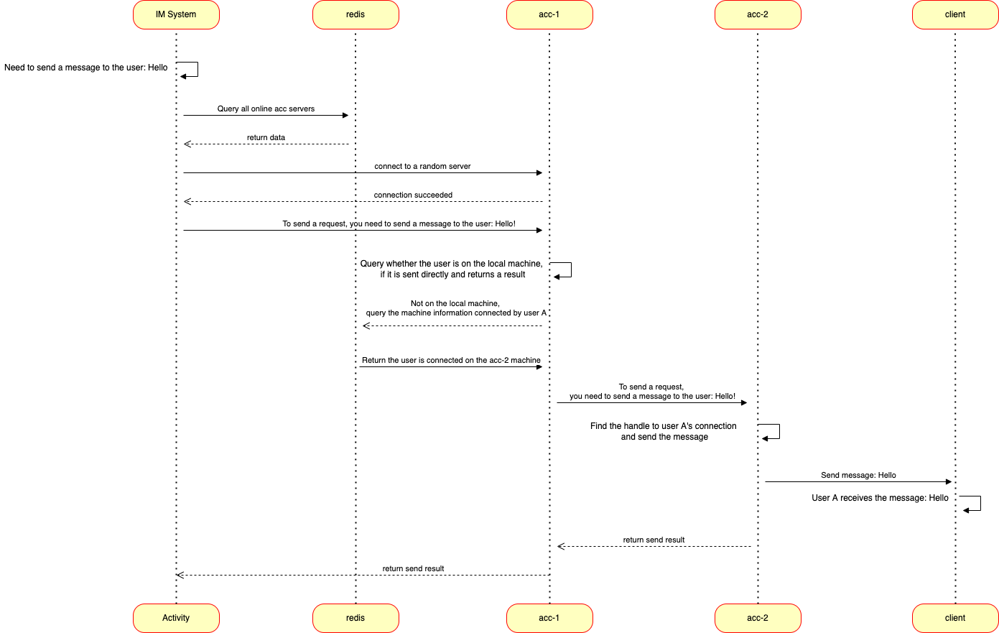

## 1 Web Socket Establishment Process
Client initiates the request for upgrade protocol first
Client initiates a request for upgrade protocol, using standard HTTP message format, and adds header information to the message.

Connection: Upgrade indicates that the connection needs to be upgraded

Upgrade: websocket needs to be upgraded to websocket protocol

Sec-WebSocket-Version: 13 Protocol Version 13

Sec-WebSocket-Key: I6qjdEaqYljv3+9x+GrhqA==This is the value of base64 encode, which is randomly generated by the browser and corresponds to the Sec-WebSocket-Accept response of the server.

```
# Request Headers
Connection: Upgrade
Host: im.91vh.com
Origin: http://domain
Pragma: no-cache
Sec-WebSocket-Extensions: permessage-deflate; client_max_window_bits
Sec-WebSocket-Key: I6qjdEaqYljv3+9x+GrhqA==
Sec-WebSocket-Version: 13
Upgrade: websocket
```



##### Server Response Upgrade Protocol
The server receives the request for the upgrade protocol, and if the server supports the upgrade protocol, it will respond as follows

Return:

Status Code: 101 Switching Protocols indicate support for handover protocols

```
# Response Headers
Connection: upgrade
Date: Fri, 09 Aug 2019 07:36:59 GMT
Sec-WebSocket-Accept: mB5emvxi2jwTUhDdlRtADuBax9E=
Server: nginx/1.12.1
Upgrade: websocket
```

##### After the upgrade protocol is completed, the client and server can send data to each other.



## How to Realize Long Link System Based on webSocket

####  Use go to implement webSocket server
###### Start Port Listening

- websocket needs to listen on ports, so it needs to start the program in a cooperative way in golang's successful main function
- main.go Implementation Startup

``` go
go websocket.StartWebSocket()
```

- init_acc.go Start Program

``` go
// Start the program
func StartWebSocket() {
    http.HandleFunc("/acc", wsPage)
    http.ListenAndServe(":8089", nil)
}
```

###### Upgrade Protocol
- Client is sent to server through http request. We need to upgrade http protocol to websocket protocol.
- Upgrade golang library for http request protocol gorilla/websocket Well done, we can use it directly.
- In practice, it is recommended that each connection use two coroutines to process client request data and send data to the client. Although opening the coroutines will take up some memory, reading separation will reduce the possibility of data jam between sending and receiving.
- init_acc.go

``` go
func wsPage(w http.ResponseWriter, req *http.Request) {

    // Upgrade protocol
    conn, err := (&websocket.Upgrader{CheckOrigin: func(r *http.Request) bool {
        fmt.Println("Upgrade protocol", "ua:", r.Header["User-Agent"], "referer:", r.Header["Referer"])

        return true
    }}).Upgrade(w, req, nil)
    if err != nil {
        http.NotFound(w, req)

        return
    }

    fmt.Println("webSocket Establish a connection:", conn.RemoteAddr().String())

    currentTime := uint64(time.Now().Unix())
    client := NewClient(conn.RemoteAddr().String(), conn, currentTime)

    go client.read()
    go client.write()

    // User Connection Events
    clientManager.Register <- client
}
```

###### Client Connection Management

- How many user connections are there in the current program, and the need for user broadcasting is also needed. Here we need a client manager to handle these events:
- Recording all connections and logged-in users can find user connections through appId+uuid
- The use of map storage involves multi-protocol concurrent read and write problems, so read and write locks are needed.
- Define four channel s to handle client connection, user login, disconnection, and full-staff broadcast events, respectively

``` go
// Connection Management
type ClientManager struct {
    Clients     map[*Client]bool   // All connections
    ClientsLock sync.RWMutex       // Read-write lock
    Users       map[string]*Client // Logged in user//appId+uuid
    UserLock    sync.RWMutex       // Read-write lock
    Register    chan *Client       // Connection Connection Processing
    Login       chan *login        // User login processing
    Unregister  chan *Client       // Disconnection handler
    Broadcast   chan []byte        // Broadcasting sends data to all members
}

// Initialization
func NewClientManager() (clientManager *ClientManager) {
    clientManager = &ClientManager{
        Clients:    make(map[*Client]bool),
        Users:      make(map[string]*Client),
        Register:   make(chan *Client, 1000),
        Login:      make(chan *login, 1000),
        Unregister: make(chan *Client, 1000),
        Broadcast:  make(chan []byte, 1000),
    }

    return
}
```

###### ASYNCHRONOUS PROCESSING PROCESSOR FOR WRITING SOCkets OF REGISTRATED CLIENTS

- Prevent program crashes, so you need to catch exceptions
- To show the location of the exception crash, use string(debug.Stack()) to print the call stack information.
- If the write data fails and there may be a connection problem, close the connection
- client.go

``` go
// Write data to client
func (c *Client) write() {
    defer func() {
        if r := recover(); r != nil {
            fmt.Println("write stop", string(debug.Stack()), r)

        }
    }()

    defer func() {
        clientManager.Unregister <- c
        c.Socket.Close()
        fmt.Println("Client send data defer", c)
    }()

    for {
        select {
        case message, ok := <-c.Send:
            if !ok {
                // Send Data Error Close Connection
                fmt.Println("Client Send data to close the connection", c.Addr, "ok", ok)

                return
            }

            c.Socket.WriteMessage(websocket.TextMessage, message)
        }
    }
}
```

###### ASYNCHRONOUS PROCESSING PROCEDURE FOR REGISTRATION OF socket OF CLIENT

- Recycle the data sent by the client and process it
- If reading data fails, close channel
- client.go

``` go
// Read client data
func (c *Client) read() {
    defer func() {
        if r := recover(); r != nil {
            fmt.Println("write stop", string(debug.Stack()), r)
        }
    }()

    defer func() {
        fmt.Println("Read client data shutdown send", c)
        close(c.Send)
    }()

    for {
        _, message, err := c.Socket.ReadMessage()
        if err != nil {
            fmt.Println("Error reading client data", c.Addr, err)

            return
        }

        // processing program
        fmt.Println("Read Client Data Processing:", string(message))
        ProcessData(c, message)
    }
}
```

###### Receiving Client Data and Processing

- The data format for sending and receiving requests is stipulated. For the convenience of js processing, the data format of json is adopted to send and receive data. (The format that human can read is more convenient to use in work development.)
- Log in to send data example:

``` json
{"seq":"1565336219141-266129","cmd":"login","data":{"userId":"Ma Yuan","appId":101}}
```

- Examples of login response data:

``` json
{"seq":"1565336219141-266129","cmd":"login","response":{"code":200,"codeMsg":"Success","data":null}}
```

- websocket is a two-way data communication, which can be sent continuously. If the data sent needs a response from the server, a seq is needed to determine which request data the server responds to.
- cmd is used to determine the action, websocket does not have a url similar to http, so specify what action cmd is
- Current actions are: login/heartbeat is used to send login requests and connection preservation (long connections without data transmission for a long time are easily disconnected by browsers, mobile middlemen, nginx, server programs)
- Why AppId is needed? UserId is the only field representing users. In order to make it universal, AppId is designed to indicate which platform users log on (web, app, ios, etc.) to facilitate subsequent expansion.
- Request data format agreed upon by request_model.go

``` go
/************************  Request data********************************************************************/
// Universal Request Data Format
type Request struct {
    Seq  string      `json:"seq"`            // The unique Id of the message
    Cmd  string      `json:"cmd"`            // Request command word
    Data interface{} `json:"data,omitempty"` // Data json
}

// Logon request data
type Login struct {
    ServiceToken string `json:"serviceToken"` // Verify that the user is logged in
    AppId        uint32 `json:"appId,omitempty"`
    UserId       string `json:"userId,omitempty"`
}

// Heart beat request data
type HeartBeat struct {
    UserId string `json:"userId,omitempty"`
}
```

- response_model.go

``` go
/************************  Response data******************************************************************/
type Head struct {
    Seq      string    `json:"seq"`      // Id of message
    Cmd      string    `json:"cmd"`      // cmd action of message
    Response *Response `json:"response"` // Message Body
}

type Response struct {
    Code    uint32      `json:"code"`
    CodeMsg string      `json:"codeMsg"`
    Data    interface{} `json:"data"` // Data json
}
```

###### Processing Client Request Data by Routing

- Processing request data sent by client using routing
- After adding the request type later, you can use the class to process it in a router-controller manner similar to http.
- acc_routers.go

``` go
// Websocket routing
func WebsocketInit() {
    websocket.Register("login", websocket.LoginController)
    websocket.Register("heartbeat", websocket.HeartbeatController)
}
```

###### Preventing memory overflow and Goroutine non-recycling

- Timing tasks clear timeout connections
Connection without login and connection without heartbeat for 6 minutes disconnect

client_manager.go

``` go
// Timely Cleaning Overtime Connections
func ClearTimeoutConnections() {
    currentTime := uint64(time.Now().Unix())

    for client := range clientManager.Clients {
        if client.IsHeartbeatTimeout(currentTime) {
            fmt.Println("Heart beat timeout closes connection", client.Addr, client.UserId, client.LoginTime, client.HeartbeatTime)

            client.Socket.Close()
        }
    }
}
```

- When reading and writing Goroutine fails, they are mutually closed
write()Goroutine fails to write data, closes c.Socket.Close() connection, and closes read()Goroutine
read()Goroutine fails to read data, closes close(c.Send) connection, and closes write()Goroutine

- Client active shutdown
Turn off reading and writing Goroutine
Delete connections from ClientManager

- Monitor User Connection, Goroutine Number
Nine out of ten memory overflows are related to Goroutine
Add an http interface to view the status of the system and prevent Goroutine from not recycling
View System Status

- Nginx configures inactive connection release time to prevent forgetting to close connections
- Performance and time-consuming analysis using pprof

#### Implementing webSocket Client with javaScript

###### Start and register the monitoring procedure

- js establishes connections and handles event handling for successful connections, data receipts and disconnections

``` go
ws = new WebSocket("ws://127.0.0.1:8089/acc");

 
ws.onopen = function(evt) {
  console.log("Connection open ...");
};
 
ws.onmessage = function(evt) {
  console.log( "Received Message: " + evt.data);
  data_array = JSON.parse(evt.data);
  console.log( data_array);
};
 
ws.onclose = function(evt) {
  console.log("Connection closed.");
};
```

###### Send Data

- Note: Data can be sent only after the connection has been successfully established
- An example of sending data from the client to the server after establishing a connection

``` js
Sign in:
ws.send('{"seq":"2323","cmd":"login","data":{"userId":"11","appId":101}}');

//Heart beat:
ws.send('{"seq":"2324","cmd":"heartbeat","data":{}}');
 
//Close the connection:
ws.close();
```

## goWebSocket Project

#### Project Description

- This project is a distributed IM system based on webSocket.
- The client randomly assigns the user name, and everyone enters a chat room to realize the function of group chat.
- Single machine (24 cores 128G memory) supports millions of client connections
- Horizontal deployment is supported, and deployed machines can communicate with each other
- Project Architecture Diagram



#### Project Dependence

- This project only needs redis and golang
- This project uses govendor to manage dependencies, so cloning this project can be used directly.

``` cmd
# Packets mainly used
github.com/gin-gonic/gin@v1.4.0
github.com/go-redis/redis
github.com/gorilla/websocket
github.com/spf13/viper
google.golang.org/grpc
github.com/golang/protobuf
```

#### Project Start

- Modify project configuration

``` cmd
cd config
mv app.yaml.example app.yaml
# Modify project listening port, redis connection, etc. (default 127.0.0.1:3306)
vim app.yaml
# Return to the project directory to prepare for future startup
cd ..
```

- Configuration File Description

``` yml
app:
  logFile: log/gin.log # Location of log files
  httpPort: 8080 # http port
  webSocketPort: 8089 # webSocket port
  rpcPort: 9001 # Distributed Deployment Program Internal Communication Port
  httpUrl: 127.0.0.1:8080
  webSocketUrl:  127.0.0.1:8089

redis:
  addr: "localhost:6379"
  password: ""
  DB: 0
  poolSize: 30
  minIdleConns: 30  
```

- Start the project

``` cmd
go run main.go
```

- Enter IM Chat Address
http://127.0.0.1:8080/home/index

- Here, you can experience the IM system based on webSocket

## Nginx configuration of webSocket project

#### Why configure Nginx

- Using nginx to separate the intranet from the intranet, only exposing the Ip of Nginx to the outside world (the general Internet enterprise will add a layer of LVS before nginx to balance the load), so as to reduce the possibility of intrusion.
- Using Nginx can make use of Nginx's load function. When the front end is reused, it only needs to connect to a fixed domain name and distribute traffic to different machines through Nginx.
- We can also use Nginx's different load strategies (polling, weight, ip_hash)

#### nginx configuration
- Using the domain name im.91vh.com as an example, reference configuration
- The first-level directory domain/acc is used for webSocket and is forwarded to golang 8089 port with nginx stream forwarding function (nginx 1.3.31 is supported and Tengine configuration is the same).
- Other directories are for HTTP and forwarded to golang 8080 port for processing

``` cmd
upstream  go-im
{
    server 127.0.0.1:8080 weight=1 max_fails=2 fail_timeout=10s;
    keepalive 16;
}

upstream  go-acc
{
    server 127.0.0.1:8089 weight=1 max_fails=2 fail_timeout=10s;
    keepalive 16;
}


server {
    listen       80 ;
    server_name  domain;
    index index.html index.htm ;


    location /acc {
        proxy_set_header Host $host;
        proxy_pass http://go-acc;
        proxy_http_version 1.1;
        proxy_set_header Upgrade $http_upgrade;
        proxy_set_header Connection $connection_upgrade;
        proxy_set_header Connection "";
        proxy_redirect off;
        proxy_intercept_errors on;
        client_max_body_size 10m;
    }

    location /
    {
        proxy_set_header Host $host;
        proxy_pass http://go-im;
        proxy_http_version 1.1;
        proxy_set_header Connection "";
        proxy_redirect off;
        proxy_intercept_errors on;
        client_max_body_size 30m;
    }

    access_log  /link/log/nginx/access/im.log;
    error_log   /link/log/nginx/access/im.error.log;
}
```

#### Problem Handling

- Run the nginx test command to see if the configuration file is correct

``` cmd
/link/server/tengine/sbin/nginx -t
```

- If an error occurs

``` cmd
nginx: [emerg] unknown "connection_upgrade" variable
configuration file /link/server/tengine/conf/nginx.conf test failed
```

- processing method
- Add in nginx.com

``` cmd
http{
    fastcgi_temp_file_write_size 128k;
..... # What needs to be added

    #support websocket
    map $http_upgrade $connection_upgrade {
        default upgrade;
        ''      close;
    }

.....
    gzip on;
    
}
```

- Reason: When Nginx proxy webSocket, you will encounter Nginx design problems End-to-end and Hop-by-hop Headers

## Pressure measurement

#### Linux Kernel Optimization

- Set the number of file open handles

``` cmd
ulimit -n 1000000
```

- Setting sockets connection parameters

``` cmd
vim /etc/sysctl.conf
net.ipv4.tcp_tw_reuse = 1
net.ipv4.tcp_tw_recycle = 0
```

#### Pressure measurement preparation
- To be measured, if you have the results of pressure measurement, you are welcome to add

#### Piezometric Data
- When the project is actually in use, each connection accounts for about 24 Kb of memory and one Goroutine for about 11 kb.
- Supporting millions of connections requires 22G of memory

Number of online users	cup	Memory	I/O	net.out 
1W				
10W				
100W

## How to Implement a Distributed Im Based on webSocket

#### Note

Get all online users, query all users of single-Front services + all users of services in the cluster
To send messages, we use the http interface to send messages (the webpage version of wechat is also the http interface). There are two main points to consider here:
1. Separation of services, making acc system as simple as possible, without mixing other business logic
2. Sending messages is based on http interface, not using webSocket connection, only using the way of separating receiving and sending data, which can speed up the efficiency of sending and receiving data.

## Architecture

- Project Start Registration and User Connection Sequence Diagram



- Other systems (IM, tasks) send message sequence diagrams to users connected to webSocket(acc) systems



## Review and Reflection

#### Application in Other Systems

- The original intention of this system design is to maintain a long link with the client and two interfaces with the external system (inquiring whether the user is online, pushing the message to the online user), so as to realize the separation of business.
- Only when it is separated from the business can it be used by multiple businesses, instead of creating a long link for each business.

#### Functions Realized

- gin log log (request log + debug log)
- Read Configuration File Complete
- Timing script to clear out expired heartbeat links
- http interface to get the number of logins and links completed
- http interface, send push, query how many people completed online
- grpc program internal communication, send message completion
- appIds A user logs on to multiple platforms
- Interface, pull all online people into a group, send messages to complete
- Completion of Single Chat and Group Chat
- Realize Distributed, Horizontal Expansion Completed
- Pressure test script
- Document collation
- Document catalog, implementation of millions of long links, why to implement an IM, and how to implement an Im
- Architecture diagrams and extensions

IM implementation details:

- Define text message structure completion
- html Sends Text Message Completion
- The interface receives text messages and sends them to the whole body for completion.
- html receives messages and displays them to the interface for completion
- Interface optimization needs continuous optimization
- When someone joins, the broadcasting is completed.
- Define the completion of the message structure to join the chat room
- Introduction of robots to be determined

#### Need to be perfected and optimized

- Log in, use Wechat to log in and get nicknames, avatars, etc.
- Have account system, data system
- Interface optimization and adapting mobile terminal
- Message Text Messages (Support Expressions), Pictures, Voice, Video Messages
- Microservice registration, discovery, fuse, etc.
- Add configuration items, maximum number of connections per machine

#### Summary
- Although a distributed IM for chat is implemented, many details are not handled (login is not authenticated, interface needs to be optimized, etc.), but you can see from this example that a lot of business needs can be solved through WebSocket.
- Although this article claims that a single machine can have millions of long links (memory can meet), but the actual scenario is much more complex than this (some pressure on the cpu). Of course, if you have such a large amount of business to buy more machines to better support your business, this program just demonstrates how to use webSocket in actual work.
- Referring to this article, you can implement a program that meets your needs.